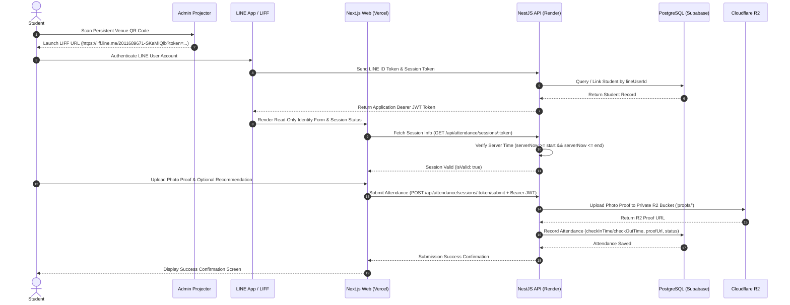

# Final System Architecture Specification

## University Event Management and Attendance Verification System

This document details the complete system architecture, data flow pipelines, security boundaries, and component responsibilities for the production environment.

---

## 1. System Context & Overview Diagram

```text
┌────────────────────────────────────────────────────────────────────────────────────────┐
│                                   CLIENT LAYER                                         │
│                                                                                        │
│   ┌───────────────────────────┐      ┌───────────────────────────┐                     │
│   │       STUDENT MOBILE      │      │    ADMINISTRATOR DESK     │                     │
│   │  (LINE App / LIFF Web)    │      │  (Next.js Management UI)  │                     │
│   └─────────────┬─────────────┘      └─────────────┬─────────────┘                     │
└─────────────────┼──────────────────────────────────┼───────────────────────────────────┘
                  │                                  │
                  │ Scan Persistent QR / HTTPS       │ HTTPS / Admin JWT
                  v                                  v
┌────────────────────────────────────────────────────────────────────────────────────────┐
│                                FRONTEND APPLICATION                                    │
│                                                                                        │
│   ┌────────────────────────────────────────────────────────────────────────────────┐   │
│   │                 Next.js 14 App Router (Deployed on Vercel)                      │   │
│   │  - /events & /events/[id]        (Student Public Views)                        │   │
│   │  - /attendance/session/[token]   (LIFF Student Attendance Form)                │   │
│   │  - /admin                        (Admin Event Console)                         │   │
│   │  - /admin/events/[id]/projector/*(Check-In & Check-Out Displays)              │   │
│   └────────────────────────────────────────┬───────────────────────────────────────┘   │
└────────────────────────────────────────────┼───────────────────────────────────────────┘
                                             │
                                             │ HTTPS API Requests / Bearer JWT
                                             v
┌────────────────────────────────────────────────────────────────────────────────────────┐
│                                BACKEND SERVICES LAYER                                  │
│                                                                                        │
│   ┌────────────────────────────────────────────────────────────────────────────────┐   │
│   │                    NestJS 10 API (Deployed on Render)                          │   │
│   │  - AuthController & AuthService          (JWT & Admin Auth)                    │   │
│   │  - EventsController & EventsService        (Event Lifecycle)                     │   │
│   │  - AttendanceController & Service          (Session & Timing Enforcement)        │   │
│   │  - StorageService (S3StorageProvider)      (Proof Photo Pipeline)                │   │
│   │  - LineMessagingService                    (Outbound LINE Push)                  │   │
│   └───────────────┬────────────────────────┬─────────────────────────┬─────────────┘   │
└───────────────────┼────────────────────────┼─────────────────────────┼─────────────────┘
                    │                        │                         │
                    │ Prisma ORM             │ AWS S3 SDK              │ HTTPS Push
                    v                        v                         v
┌───────────────────┴──────┐   ┌─────────────┴────────────┐   ┌────────┴─────────────────┐
│   DATABASE PERSISTENCE   │   │  OBJECT STORAGE (R2)     │   │   EXTERNAL MESSAGING     │
│                          │   │                          │   │                          │
│  Supabase PostgreSQL DB  │   │   Cloudflare R2 Bucket   │   │   LINE Messaging API     │
│  (Tables: students,      │   │   (Private proofs/       │   │   & Official Account     │
│   events, sessions,      │   │    subfolder)            │   │                          │
│   attendances, admins)   │   │                          │   │                          │
└──────────────────────────┘   └──────────────────────────┘   └──────────────────────────┘
```

---

## 2. Mermaid Sequence Diagram: Student Attendance Flow



---

## 3. Component Responsibilities

### 3.1 Student Mobile Client (LINE App / LIFF)
- **Scanner Entry**: Scans persistent venue QR codes displaying the designated LIFF URL.
- **LINE Authentication**: Uses `@line/liff` SDK v2 to request user consent, obtain `idToken`, and retrieve profile metadata.
- **Identity Display**: Renders the student's full name, student ID, faculty, major, and year in a read-only format.
- **Submission**: Captures photo proof via mobile camera or file picker and POSTs to the backend along with the Bearer JWT.

### 3.2 Next.js Web Frontend (Vercel)
- **Public Views**: Renders event details, schedule, and information (`/events`, `/events/[id]`).
- **LIFF Attendance View**: Handles the student scanner landing page (`/attendance/session/[token]`). Enforces client-side validation states while respecting backend authority.
- **Admin Console**: Provides event management dashboard (`/admin`), event creation (`/admin/events/new`), event editing (`/admin/events/[id]/edit`), and attendance record inspection (`/admin/events/[id]/attendance`).
- **Projector Views**: Displays time-synced persistent QR codes (`/admin/events/[id]/projector/check-in` & `check-out`).

### 3.3 NestJS Backend API Service (Render)
- **Auth Module**: Handles admin authentication (`/api/auth/admin/login`) and profile retrieval (`/api/auth/admin/me`). Signs and verifies JWT tokens using `JwtService`.
- **Events Module**: Exposes CRUD endpoints for managing events. Triggers LINE announcement messages on creation.
- **Attendance Module**: Enforces server-authoritative time-window validation (`serverNow >= windowStart && serverNow <= windowEnd`), prevents duplicate check-in/out submissions, and manages persistent QR tokens.
- **Storage Module**: Provides an abstract `StorageService` using `S3StorageProvider` to interact with S3-compatible Cloudflare R2 storage.
- **LINE Module**: Encapsulates `LineMessagingService` to push broadcast and targeted event notifications.

### 3.4 Supabase PostgreSQL Database
- **Persistence**: Stores relational entities (`Student`, `Admin`, `Event`, `AttendanceSession`, `Attendance`).
- **Integrity Enforcement**: Enforces `@@unique([studentId, eventId])` to guarantee a single attendance record per student per event, and `@unique` constraints on session tokens and LINE user IDs.
- **Timestamp Precision**: Stores all DateTime values using standard UTC `TIMESTAMPTZ`.

### 3.5 Cloudflare R2 Object Storage
- **Private Bucket**: Stores student photo proof files in a private `proofs/` subfolder.
- **Security**: Direct public access is disabled. Proof images are streamed through the backend's protected proxy route (`GET /api/attendance/uploads/proofs/:filename`), which requires an authenticated Admin JWT.

### 3.6 LINE Official Account & Messaging API
- **Event Announcements**: Pushes event notifications to subscribed students upon event creation.
- **Push Messages**: Sends confirmation notifications upon successful attendance check-in and check-out.

---

## 4. Key Architectural Guarantees

1. **Persistent Dual-QR Model**: Every event has exactly one permanent `CHECK_IN` session token and one permanent `CHECK_OUT` session token stored in `attendance_sessions`. Tokens do not regenerate when windows open or close.
2. **Server-Authoritative Boundaries**: Time-window validity (`isValid`) is calculated strictly on the backend using the server clock.
3. **No Dev Bypass in Production**: The development fallback (`x-dev-student-id`) is disabled when `NODE_ENV=production` (`isDev=false`).
4. **Data Isolation**: Students cannot view or access other students' proof images or admin attendance dashboards.
